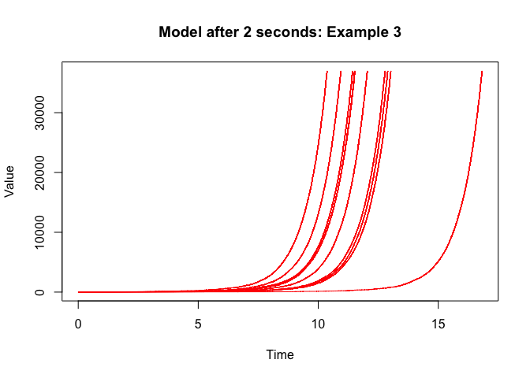

ssar: Stochastic Simulation Algorithm in R
================

The R package *ssar* is a fast implementation of Gillespie's Stochastic Simulation Algorithm. It combines R's graphical and statistical capabilities with the speed of C++. In addition, the package allows for simulation of stochastic processes with time-dependent propensity functions Thus, *ssar* represents an improvement over the previous package available at CRAN [*GillespieSSA*](https://cran.r-project.org/web/packages/GillespieSSA/index.html).

Is this package for me?
-----------------------

This package is for you if:

-   You want to simulate Continuous Time Markov Chains (CTMC), Stochastic Compartmental Models (like the ones in chemistry, ecology, epidemiology).

-   You want to use Gillespie's Stochastic Simulation Algorithm with time-dependent parameters, random parameters and/or time-dependent random parameters. (Areas might include Bayesian MonteCarlo parameter estimation of some Stochastic Processes or Inhomogeneous Continuous Time Markov Chains)

-   You are tired of the current packages being too slow.

-   You want to have fun simulating stuff!

Installation
------------

*ssar* is still at its developmental stage. You need to install from github:

``` r
install.packages("devtools")
devtools::install_github("INSP-RH/ssar")
```

To adecquately run `ssar`you need to install a `C++` compiler:

-   On Windows, install [Rtools](https://cran.r-project.org/bin/windows/Rtools/).
-   On Mac, install Xcode from the App store.
-   On Linux, `sudo apt-get install r-base-dev` or similar.

Examples
--------

After installing you need to call the *ssar* package for using it.

``` r
library(ssar)
```

### 1. Logistic Growth

First, we set the seed for the simulation.

``` r
set.seed(123)
```

Initial data must be inputed as a matrix.

``` r
X          <- matrix(c(N=500), nrow = 1)
```

The propensity vector should also be in matrix form:

``` r
v          <- matrix( c(+1, -1), ncol = 2)
```

The propensity scores must also be a matrix-valued function depdendent on 3 parameters: time (`t`), the state of the system (`X`) and additional parameters (`params`) which we discuss later.

``` r
pfun       <- function(t,X,params){ cbind(2 * X[, 1], (1 + 1*X[, 1]/1000)*X[, 1]) }
```

The model runs automatically from *0* to *1* conducting *10* simulations and generating a plot.

``` r
simulation <- ssa(X, pfun, v)
```


The `nsim` variable specifies the number of simulations. Suppose we want *20* of them:

``` r
simulation <- ssa(X, pfun, v, nsim = 20)
```


The `tmin` and `tmax` variables specify the initial time and final time of the process. Suppose we want to simulate from time *2* to time *10* with *20* simulations:

``` r
simulation <- ssa(X, pfun, v, tmin = 2, tmax = 10, nsim = 20)
```


Plot characteristics can be specified by `title`, `xlab` and `ylab`:

``` r
simulation <- ssa(X, pfun, v, tmin = 2, tmax = 10, nsim = 20, 
                  title = "Logistic Growth: Example 1", 
                  xlab = "Time", ylab = "Individuals")
```


Making plots can really slow down the process. The option: `plot.sim` when set to `FALSE` allows us to keep the data without making any plot:

``` r
simulation <- ssa(X, pfun, v, tmin = 2, tmax = 10, nsim = 20, plot.sim = FALSE)
```

The `simulation` dataframe looks like this:

    ##   Simulation Iteration Time Var1
    ## 1          1         0    2  500
    ## 2          2         0    2  500
    ## 3          3         0    2  500
    ## 4          4         0    2  500
    ## 5          5         0    2  500
    ## 6          6         0    2  500

### 2. Time-dependent Logistic Growth

Suppose we are using almost the same model as in the previous example:

``` r
set.seed(322)
X          <- matrix(c(N=500), nrow = 1)   #Initial values
v          <- matrix( c(+1, -1), ncol = 2) #Propensity scores
```

But the propensity function now depends on time:

``` r
pfun       <- function(t,X,params){ cbind(2 * X[, 1], 
                                          (2 + sin(t*pi)*X[, 1]/1000)*X[, 1]) }
```

Simulation is done in exactly the same manner as previously done. No change needed!

``` r
simulation <- ssa(X, pfun, v, tmin = 2, tmax = 10, nsim = 20, 
                  title = "Time-dependent Logistic Growth: Example2", 
                  xlab = "Time", ylab = "Individuals")
```


### 3. Exponential model

This is a new model given by the following parameters:

``` r
 #Start the parameters
 X          <- matrix(c(N = 10), nrow = 1)
 pfun       <- function(t, X, params){ cbind(1.1 + sin(pi*t/0.01))*X[,1] }
 v          <- matrix( c(+1), ncol=1)
```

``` r
 simulation <- ssa(X, pfun, v,
                   title = "Example 3", xlab = "Time", ylab = "Value")
```


The option `maxiter` establishes the maximum number of iterations done by the model before stopping. For example if we wish to know where the model is after *100* changes set `maxiter = 100`:

``` r
 simulation <- ssa(X, pfun, v, maxiter = 100, 
                   title ="Model after 100 changes: Example 3",
                   xlab = "Time", ylab = "Value")
```


The option `print.time` prints to screen at what in time of the simulation we are. For example if the model goes from `tmin = 0` to `tmax = 1` setting `print.time = TRUE` will print at which moment in time the model is simulating:

``` r
 simulation <- ssa(X, pfun, v, maxiter = 100, tmin = 0, tmax = 1,
                   plot.sim = FALSE, print.time = TRUE)
```

    ## Time = 0
    ## Time = 0
    ## Time = 0.00284842
    ## Time = 0.0210763
    ## Time = 0.115414
    ## Time = 0.219506
    ## Time = 0.277526

The option `maxtime` establishes how much computer-time (in seconds) will be used for the model. This is specially useful for models which might take a lot of time to run. In the following example, we run the model for *2* seconds:

``` r
 simulation <- ssa(X, pfun, v, maxtime = 2, 
                   title ="Model after 2 seconds: Example 3",
                   xlab = "Time", ylab = "Value" )
```



### 4. Lotka-Volterra

<a name="lvolterra"></a> We find it easier to assign the *parameters* (constants) used by the propensity function as a separate vector. This is done in the following simulation:

``` r
#Set seed
set.seed(3289650)

#Get initial parameters
params     <- c(a = 3, b = 0.01, c = 2)
X          <- matrix(c(100, 100), ncol = 2)

#Propensity function
pfun       <- function(t, X, params){ cbind(params[1]*t*X[,1] + 1, 
                                              params[2]*X[,1]*X[,2], 
                                                params[3]*X[,2]) }
#Propensity score
v          <- matrix(c(+1,-1,0,0,+1,-1),nrow=2,byrow=TRUE)

#Simulate
simulation <- ssa(X, pfun, v, params, 
                  title = "Example 4: Time-dependent Lotka-Volterra",
                  xlab = "Time", ylab = "Number of individuals")
```


<a name="keepfilesec"></a> The `ssa` function works by creating a file called *"Temporary\_File\_ssa.txt"*. Setting to `TRUE` option `keep.file` does not remove the temporary file. Furthermore, the option `fname` allows you to rename the file. This option is really helpful if you want to keep a database of your simulation:

``` r
simulation <- ssa(X, pfun, v, params, keep.file = TRUE, fname ="My_simulation.txt",
                  plot.sim = FALSE)
```

You can read the file with the `read.table` function:

``` r
sim        <- read.table("My_simulation.txt",  header = TRUE)
```

    ##   Simulation Iteration Time Var1 Var2
    ## 1          1         0    0  100  100
    ## 2          2         0    0  100  100
    ## 3          3         0    0  100  100
    ## 4          4         0    0  100  100
    ## 5          5         0    0  100  100
    ## 6          6         0    0  100  100

If you are a `ggplot2` kind of person you can plot easily your simulations:

``` r
library(ggplot2)
ggplot(data = sim, aes(x = Time, group = as.factor(Simulation))) +
    geom_line(aes(y = Var1, color = "Prey")) +
    geom_line(aes(y = Var2, color = "Predator")) +
    ggtitle("Example 4: Lotka Volterra with ggplot2") + 
    xlab("Time") + ylab("Individuals") +
    scale_color_manual("Creature", 
                       values = c("Prey" = "deepskyblue4","Predator" = "tomato3"))
```


### 5. Lotka-Volterra with random time-dependent parameters

This is almost the same Lotka-Volterra model; however in this case the parameters *a* and *b* are random variables.

``` r
#Set seed
set.seed(3289650)

#Get initial parameters
params     <- c(amu = 3, asd = 0.01, bmin = 0.001, bmax = 0.015, c = 2)
X          <- matrix(c(100, 100), ncol = 2)

#Propensity function
pfun       <- function(t, X, params){ cbind(rnorm(1,params[1], params[2])*X[,1] + 1, 
                                            runif(1,params[3],params[4])*X[,1]*X[,2], 
                                                params[5]*X[,2]) }
#Propensity score
v          <- matrix(c(+1,-1,0,0,+1,-1),nrow=2,byrow=TRUE)

#Simulate
simulation <- ssa(X, pfun, v, params, 
                  title = "Example 5: Lotka-Volterra with random variables",
                  xlab = "Time", ylab = "Number of individuals")
```


Notice that the random variables in the model can also be time-dependent:

``` r
#Propensity function
pfun       <- function(t, X, params){ 
              cbind(rnorm(1,t + params[1], params[2])*X[,1] + 1, 
                    runif(1,params[3],params[4])*X[,1]*X[,2], params[5]*X[,2]) }

#Simulate
simulation <- ssa(X, pfun, v, params, 
              title = "Example 5: Lotka-Volterra with time-dependent random variables",
              xlab = "Time", ylab = "Number of individuals")
```


### 6. Additional tips for running faster and/or with less memory

Sometimes your model might take a lot of time to run. The following list of options might help you speed it up:

-   Do not print the current time: `print.time = FALSE`

The fastest way to speed up your code is via the `file.only` and `kthsave` options

### The `file.only` option

As we said in the [previous section](#keepfilesec), the program generates a Temporary File. The `file.only` option generates the file but does not return any values to `R`nor does it generate a plot. It is meant for making fast simulations in which the user might not be interested in generating a plot inside the function.

As an example, consider the [Lotka-Volterra model](#lvolterra).

``` r
#Set seed
set.seed(3289650)

#Get initial parameters
params     <- c(a = 3, b = 0.01, c = 2)
X          <- matrix(c(100, 100), ncol = 2)

#Propensity function
pfun       <- function(t, X, params){ cbind(params[1]*t*X[,1] + 1, 
                                              params[2]*X[,1]*X[,2], 
                                                params[3]*X[,2]) }
#Propensity score
v          <- matrix(c(+1,-1,0,0,+1,-1),nrow=2,byrow=TRUE)
```

Without the `file.only` option:

``` r
#Simulate
simulation <- ssa(X, pfun, v, params, plot.sim = FALSE)
```

With the `file.only` option:

``` r
#Simulate
simulation <- ssa(X, pfun, v, params, file.only = TRUE)
```

    ## [1] "********** OVERALL TIME EVALUATION **********"

    ## [1] "Normal eval:     0.0787589550018311"

    ## [1] "file.only = TRUE: 0.0568051338195801"

    ## [1] "*********************************************"

This might not look as fast; However in bigger files, it is really important. Additional benchmarks are provided in the [Benchmarking section](#benchmarking)

### The `kthsave` option

The Stochastic Simulation Algorithm computes and saves every transition made in the model. This might not be a problem for short simulations; but in the long run generates large databases which are pretty memory intensive. The `kthsave` option is here to help.

Consider the following model which is a variant of the SIS model for epidemics:

``` r
 #Initial parameters
 k          <-  24576.5529836797
 delta      <-  0.0591113454895868 + 0.208953907151055
 gamma_ct   <-  0.391237630231631
 params     <- c(k = k, delta = delta, gamma_ct = gamma_ct)
 X          <- matrix(c(S = 1000000000, I = 1000), ncol = 2)
 pfun       <- function(t, X, params){

   #Value to return
   matreturn  <- matrix(NA, nrow = length(t), ncol = 6)

   #Create birth function
   lambda     <- function(t){ return(4.328e-4 - (2.538e-7)*t - 
                              (3.189e-7)*sin(2 * t * pi/52) - 
                              (3.812e-7)*cos(2 * t * pi/52) ) }

   #Create death function
   mu         <- function(t){ return(9.683e-5 + (1.828e-8)*t + 
                              (2.095e-6)*sin(2 * t * pi/52) - 
                              (8.749e-6)*cos(2 * t * pi/52))}

   #Create infectives function
   beta_fun   <- function(t){ return( 0.479120824267286 + 
                              0.423263042762498*sin(-2.82494252560096 + 2*t*pi/52) )}

   #Estimate values
   matreturn[,1] <- lambda(t)*(X[,1] + X[,2])
   matreturn[,2] <- mu(t)*X[,1]
   matreturn[,3] <- beta_fun(t)*X[,1]*X[,2]/(1 + params[1]*X[,2])
   matreturn[,4] <- mu(t)*X[,2]
   matreturn[,5] <- params[2]*X[,2]
   matreturn[,6] <- params[3]*X[,2]

   #Return
   return(matreturn)

 }
 v          <- matrix(c(1,-1, -1, 0, 0, 1, 0, 0, 1, -1, -1, -1), nrow = 2, byrow = TRUE)
 tmin       <- 0
 tmax       <- 2
 nsim       <- 100
```

Running *100* simulations for *2* days generates over 4 GB of information:

**DO NOT RUN: MIGHT TAKE SEVERAL MINUTES**

``` r
 #DO NOT RUN 
 simulation <- ssa(X, pfun, v, params, tmin, tmax, nsim = nsim, print.time = FALSE, 
                    plot.sim = FALSE, keep.file = TRUE)
 #DO NOT RUN 
```

Running the simulation for *52* days generates over 30 GB of information. In order to speed the program and reduce the simulation time we can only save every *kth* iteration. The command *kthsave* does te trick.

The first 1000 iterations of the model look like this:

``` r
 set.seed(123)
 simulation1 <- ssa(X, pfun, v, params, tmin, tmax, nsim = 10, print.time = FALSE, 
                    plot.sim = FALSE, maxiter = 5000, keep.file = TRUE,
                    fname = "sim1.txt")
```

We now consider saving only every *10* iterations of the model:

``` r
 set.seed(123)
 simulation2 <- ssa(X, pfun, v, params, tmin, tmax, nsim = 10, print.time = FALSE, 
                    plot.sim = FALSE, maxiter = 5000, kthsave = 10, keep.file = TRUE,
                    fname = "sim2.txt")
```

There are almost no noticable differences between the models:

``` r
 ggplot(simulation1, aes(x = Time, y = Var2, group=as.factor(Simulation))) +
    geom_point(data = simulation2, 
               aes(color = "Every 10 values")) + 
    geom_step(data = simulation1, 
               aes(color = "All values"), size = 0.5) + 
    theme(legend.position="none") + theme_bw() +
    ggtitle(paste0("SIS example; Infected cases ", 10, " simulations")) + 
    xlab("Time") + ylab("Individuals") 
```


Changing `kthsave` to *10* reduces *10* times the file size. In addition, it almost halves the modeling speed:

    ## [1] "********** OVERALL TIME EVALUATION **********"

    ## [1] "All values:      0.843676090240479"

    ## [1] "Every 10 values: 0.372447967529297"

    ## [1] "*********************************************"

Benchmarking
------------

<a name="benchmarking"></a> In order to show the advantage or this package over the existing [*GillespieSSA*](https://cran.r-project.org/web/packages/GillespieSSA/index.html) we show several benchmarks. Running this in your computer requires installation of the *GillespieSSA* package and the *microbenchmark* package.

``` r
library(microbenchmark)
```

First, we run the program from *GillespieSSA*:

``` r
#Running the program from GillespieSSA
set.seed(1)
parms    <- c(c=0.5)
  x0     <- c(X=10000)
  a      <- c("c*X")
  nu     <- matrix(-1)
  
gilltime <- microbenchmark(
                out1 <- GillespieSSA::ssa(x0,a,nu,parms,tf = 100)
)
```

Notice that running this program results in only one simulation: 

In the case of our model: we can make 5 simulations faster than 1 simulation from *GillespieSSA*:

``` r
set.seed(1)

parms    <- c(0.5)
  x0     <- matrix(c(X=10000), ncol = 1)
  pfun   <- function(t,X,params){ return(as.matrix(params[1]*X[,1])) }
  nu     <- matrix(-1)

#Keeping all the information
alltime1  <- microbenchmark(
              out2 <- ssar::ssa(x0, pfun, nu, parms, tmin = 0, 
                                tmax = 100, nsim = 5, plot.sim = FALSE))

#All the iterations and file.only option
alltime2  <- microbenchmark(
              out2 <- ssar::ssa(x0, pfun, nu, parms, tmin = 0, 
                                tmax = 100, nsim = 5, file.only = TRUE))

#Keeping every 10 iterations. This is really fast in comparison.
tentime1  <- microbenchmark(
              out2 <- ssar::ssa(x0, pfun, nu, parms, tmin = 0, 
                                tmax = 100, nsim = 5, plot.sim = FALSE,
                                kthsave = 10))

#10 iterations and file.only option
tentime2  <- microbenchmark(
              out2 <- ssar::ssa(x0, pfun, nu, parms, tmin = 0, 
                                tmax = 100, nsim = 5, file.only = TRUE,
                                kthsave = 10))
```

Notice that *ssar* creates 5 simulations: 

The overall times (seconds):

<table style="width:106%;">
<colgroup>
<col width="36%" />
<col width="11%" />
<col width="12%" />
<col width="11%" />
<col width="11%" />
<col width="12%" />
<col width="11%" />
</colgroup>
<thead>
<tr class="header">
<th align="left"></th>
<th align="right">Min.</th>
<th align="right">1st Qu.</th>
<th align="right">Median</th>
<th align="right">Mean</th>
<th align="right">3rd Qu.</th>
<th align="right">Max.</th>
</tr>
</thead>
<tbody>
<tr class="odd">
<td align="left">GillespieSSA</td>
<td align="right">0.9532</td>
<td align="right">0.9894</td>
<td align="right">1.0040</td>
<td align="right">1.0090</td>
<td align="right">1.0270</td>
<td align="right">1.0790</td>
</tr>
<tr class="even">
<td align="left">All times</td>
<td align="right">0.7357</td>
<td align="right">0.7781</td>
<td align="right">0.8007</td>
<td align="right">0.8047</td>
<td align="right">0.8254</td>
<td align="right">1.0560</td>
</tr>
<tr class="odd">
<td align="left">All times file.only</td>
<td align="right">0.5058</td>
<td align="right">0.5280</td>
<td align="right">0.5347</td>
<td align="right">0.5373</td>
<td align="right">0.5405</td>
<td align="right">0.6135</td>
</tr>
<tr class="even">
<td align="left">kthsave 10</td>
<td align="right">0.3357</td>
<td align="right">0.3546</td>
<td align="right">0.3668</td>
<td align="right">0.3701</td>
<td align="right">0.3810</td>
<td align="right">0.4668</td>
</tr>
<tr class="odd">
<td align="left">kthsave 10 and file.only</td>
<td align="right">0.2926</td>
<td align="right">0.3127</td>
<td align="right">0.3243</td>
<td align="right">0.3280</td>
<td align="right">0.3384</td>
<td align="right">0.4751</td>
</tr>
</tbody>
</table>

Common errors and their meaning
-------------------------------

### `pfun` needs to be a matrix valued function

The function `pfun`is not returning a matrix. You can use `as.matrix` or `cbind` (depending on your function) to return a matrix value. As an example:

``` r
#THIS IS INCORRECT (USING c NOT cbind):
pfun       <- function(t,X,params){ c(params[1] *(1 + sin(t))* X[,1], 
                          (params[2] + (params[1]-params[2])*X[,1]/params[3])*X[,1]) }

#THIS IS CORRECT:
pfun       <- function(t,X,params){ cbind(params[1] *(1 + sin(t))* X[,1], 
                          (params[2] + (params[1]-params[2])*X[,1]/params[3])*X[,1] ) }
```

### `xinit` needs to be a matrix

The value `xinit` is probably a vector and not a matrix.

``` r
#THIS IS INCORRECT (USING c NOT cbind):
xinit <- c(X = 1, Y = 2)

#THIS IS CORRECT:
xinit <- matrix(c(X = 1, Y = 2), ncol = 1)
```

### Error in `pfun(tmin, xinit, params)` : unused argument

The `pfun`function is probably missing one of the arguments that go into the function (either `t`, `X`or `params`). As an example:

``` r
#THIS IS INCORRECT (MISSING T):
pfun       <- function(X,params){ cbind(params[1] *(1 + sin(t))* X[,1], 
                          (params[2] + (params[1]-params[2])*X[,1]/params[3])*X[,1] ) }

#THIS IS CORRECT:
pfun       <- function(t,X,params){ cbind(params[1] *(1 + sin(t))* X[,1], 
                          (params[2] + (params[1]-params[2])*X[,1]/params[3])*X[,1] ) }
```

### `nsim` is not a strictly positive integer. Defaulting to closest positive integer

If the number of simulations, `nsim` is smaller than 2, or is not an integer, the program automatically chooses a new value for `nsim` looking for the closest integer.

### `kthsave` is not a strictly positive integer. Defaulting to closest positive integer

If the number indicating after how many iterations to save, `kthsave` is smaller than 2, or is not an integer, the program automatically chooses a new value for `kthsave` looking for the closest positive integer.

### `tmin >= tmax`

The time at which the simulation starts `tmin` is bigger or equal than the time at which the simulation ends `tmax`

What is missing?
----------------

The project still needs a lot of testing and debugging. Furthermore, we are developing an automatic [tau-leaping algorithm](http://www.cs.ucsb.edu/~cse/Files/adaptivetau06.pdf) to compliment our package.

Please feel free to contribute to the project.

Contributor Code of Conduct
---------------------------

As contributors and maintainers of this project, we pledge to respect all people who contribute through reporting issues, posting feature requests, updating documentation, submitting pull requests or patches, and other activities.

We are committed to making participation in this project a harassment-free experience for everyone, regardless of level of experience, gender, gender identity and expression, sexual orientation, disability, personal appearance, body size, race, ethnicity, age, or religion.

Examples of unacceptable behavior by participants include the use of sexual language or imagery, derogatory comments or personal attacks, trolling, public or private harassment, insults, or other unprofessional conduct.

Project maintainers have the right and responsibility to remove, edit, or reject comments, commits, code, wiki edits, issues, and other contributions that are not aligned to this Code of Conduct. Project maintainers who do not follow the Code of Conduct may be removed from the project team.

Instances of abusive, harassing, or otherwise unacceptable behavior may be reported by opening an issue or contacting one or more of the project maintainers.

This Code of Conduct is adapted from the Contributor Covenant, version 1.0.0, available from <http://contributor-covenant.org/version/1/0/0/>

Licence
-------

This package is free and open source software, licensed under [GPL-3](https://www.gnu.org/licenses/gpl-3.0.html).

If you use this package please don't forget to cite it.

Authors
-------

-   Rodrigo Zepeda-Tello <rodrigo.zepeda@insp.mx>
-   Dalia Camacho-García-Formentí <daliaf172@gmail.com>
